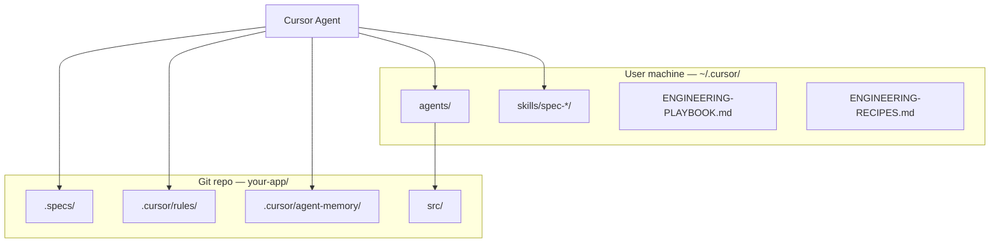

# Bootstrap plan: spec-driven engineering team (Cursor / Claude)

**Goal:** Harness the playbook on a real project in under 30 minutes, starting at **Tier 1** and promoting only when complexity demands it.

**User-level harness (already on your machine):**

| Layer | Location | Scope |
|-------|----------|-------|
| Playbook | `~/.cursor/ENGINEERING-PLAYBOOK.md` | All projects |
| Executive summary | `~/.cursor/SPEC-DRIVEN-EXECUTIVE-SUMMARY.md` | Strategy |
| Recipes | `~/.cursor/ENGINEERING-RECIPES.md` | Production flows |
| Agents (20) | `~/.cursor/agents/*.md` | All projects |
| Spec skills (8) | `~/.cursor/skills/spec-*/` | All projects |
| App template | `~/.cursor/templates/spec-driven-app/` | Copy into each repo |

**Project-level (per repo):** `.specs/`, `.cursor/rules/`, `.cursor/agent-memory/`, optional `.cursor/skills/`

---

## Architecture: two layers



- **User layer** = roles, skills, playbooks (no copy needed per project).
- **Project layer** = specs, rules, memory (commit to git).

---

## Phase 0 — Verify harness (5 min, once)

Run from terminal:

```bash
# Agents
ls ~/.cursor/agents/*.md | wc -l    # expect 20

# Spec skills
ls -d ~/.cursor/skills/spec-*       # expect 8 folders

# Docs
test -f ~/.cursor/ENGINEERING-PLAYBOOK.md && echo "playbook OK"
test -f ~/.cursor/ENGINEERING-RECIPES.md && echo "recipes OK"
```

In **Cursor → Settings → Rules → Skills**, confirm skills like `spec-pipeline`, `spec-req-author` appear.

**Claude Code parity:** Cursor also discovers `~/.claude/agents/` and `~/.claude/skills/`. Optional symlink if you use both:

```bash
# Optional — only if you use Claude Code on the same machine
ln -sf ~/.cursor/agents ~/.claude/agents
ln -sf ~/.cursor/skills ~/.claude/skills
```

---

## Phase 1 — Create or open project (2 min)

1. Create repo folder or open existing app in Cursor (**File → Open Folder**).
2. Initialize git if new: `git init`
3. Decide **complexity tier** (default **Tier 1** for new apps):

| Tier | When |
|------|------|
| 0 | Throwaway spike only |
| **1** | **MVP / new app (start here)** |
| 2 | Users, releases, security surface |
| 3 | Enterprise, PII, multi-service, regulated |

Record in chat: `Tier: 1`

---

## Phase 2 — Bootstrap project scaffold (5 min)

From your **project root**:

```bash
export PROJECT_ROOT="$(pwd)"
bash ~/.cursor/templates/spec-driven-app/scripts/bootstrap-project.sh "$PROJECT_ROOT"
```

Or manually:

```bash
cp -R ~/.cursor/templates/spec-driven-app/.specs .
cp -R ~/.cursor/templates/spec-driven-app/.cursor .
cp -R ~/.cursor/templates/spec-driven-app/scripts .
bash scripts/bootstrap-agent-memory.sh   # all 20 agent memory folders
```

Optional — copy spec skills into repo (team shares via git):

```bash
mkdir -p .cursor/skills
cp -R ~/.cursor/skills/spec-* .cursor/skills/
```

Add `.cursorignore` at project root (see playbook §7):

```
dist/
build/
node_modules/
*.lock
coverage/
.terraform/
*.tfstate
```

**Commit scaffold:**

```bash
git add .specs .cursor scripts .cursorignore 2>/dev/null || git add .specs .cursor scripts
git commit -m "chore: bootstrap spec-driven engineering scaffold"
```

---

## Phase 3 — Fill project memory (5 min)

Edit these files before first agent run:

| File | Fill in |
|------|---------|
| `.cursor/agent-memory/_project/MEMORY.md` | App name, stack, test command, branch strategy |
| `.cursor/agent-memory/_project/specs-index.md` | REQ-001 / ARCH-000 status |
| `.specs/requirements/REQ-001-product-scope.md` | Problem statement, 3–5 acceptance criteria |

Rules auto-apply from `.cursor/rules/spec-driven.mdc` and `agent-memory.mdc`.

---

## Phase 4 — First agent session (Tier 1)

Open **Agent chat** in the project folder. Use this **starter prompt**:

```
/spec-pipeline

Tier: 1
Recipe: new-application

We are building [ONE PARAGRAPH: users, core features, preferred stack].

1. Read .cursor/agent-memory/_project/MEMORY.md and ENGINEERING-PLAYBOOK.md (user path).
2. Update REQ-001-product-scope.md with testable acceptance criteria.
3. Do NOT run full Tier 3 pipeline — use Tier 1: requirements-analyst → fullstack-engineer → test-runner → verifier.
4. Challenger optional for REQ-001 unless you find major ambiguity.
5. End with HANDOFF and memory updates.
```

### Tier 1 flow (default)

```
eng-orchestrator
  → requirements-analyst  (REQ-001)
  → fullstack-engineer    (after REQ APPROVED or DRAFT+explicit approval)
  → test-runner
  → verifier              (reads REQ-001 only)
```

### When to invoke `/eng-orchestrator` explicitly

```
/eng-orchestrator Tier 1, recipe greenfield-feature — add user notifications per REQ-002
```

---

## Phase 5 — Production recipes (after go-live)

Switch recipes by work type — not always full feature pipeline:

| Work | Invoke |
|------|--------|
| New feature | `/eng-orchestrator recipe: greenfield-feature — …` |
| Bug | `/eng-orchestrator recipe: bug-fix — …` |
| Urgent prod | `/eng-orchestrator recipe: hotfix — …` |
| Dependency bump | `/eng-orchestrator recipe: maintenance — …` |
| Terraform / CI | `/eng-orchestrator recipe: infra-change — …` |

Cheat sheet: `/spec-recipes`

---

## Phase 6 — Promote tier (only with evidence)

Promote **Tier 1 → 2** when any trigger fires:

- [ ] Public API or external consumer
- [ ] Auth, PII, or payments
- [ ] Repeated bugs from unclear specs
- [ ] Second person/agent must resume without re-explaining

**Add agents:** `architect`, `challenger`, `code-reviewer`, `security-reviewer`, `spec-guardian`

Promote **Tier 2 → 3** when:

- [ ] Multi-service / regulated / formal compliance
- [ ] Full contracts and test plans required

**Use full 20-agent roster** and full `.specs/` tree.

---

## Phase 7 — Operating rhythm

### Per feature (Tier 1)

1. Update or create `REQ-NNN.md`
2. Implement against REQ
3. `test-runner` green
4. `verifier` against REQ
5. Update `specs-index.md` + memory
6. **Checkpoint** (Principle 8): optional `.specs/handoffs/GATE-*.md`; fresh subagent or new chat for next REQ with **paths only**

### Per gate (all tiers)

Before next agent: persist specs + `specs-index.md` + orchestrator memory → delegate ≤500 words, mostly paths → **do not resume** across REQ→implement→verify

### Per release (Tier 2+)

1. `spec-guardian` drift check
2. `challenger` on material ARCH changes
3. Update `CHANGELOG.md` under `.specs/`

### Per day (you)

- Prefer **spec file paths** in prompts, not long chat history
- Start a **new Agent chat** when a REQ/phase is DONE or context feels stale
- Use `/spec-pipeline` or `/spec-recipes` when unsure
- Spikes: Tier 0 without `.specs/`; promote learnings into REQ before merge

---

## Quick reference — slash commands

| Command | Purpose |
|---------|---------|
| `/spec-pipeline` | Gates + default pipeline |
| `/spec-recipes` | Bug / hotfix / maintenance recipes |
| `/eng-orchestrator` | Full orchestration |
| `/requirements-analyst` | Write REQ |
| `/challenger` | Adversarial spec review |
| `/architect` | ARCH + ADR |
| `/fullstack-engineer` | Implement slice |
| `/test-runner` | Run tests |
| `/verifier` | Verify vs REQ |
| `/spec-guardian` | Drift audit |

Skills (auto or manual): `spec-req-author`, `spec-arch-author`, `spec-challenger`, `spec-verifier`, `spec-handoff`, `spec-agent-memory`

---

## Bootstrap checklist

### User machine (once)

- [ ] 20 agents in `~/.cursor/agents/`
- [ ] 8 `spec-*` skills in `~/.cursor/skills/`
- [ ] Playbook + recipes + executive summary present
- [ ] Skills visible in Cursor Settings → Rules

### Per project

- [ ] `.specs/` committed
- [ ] `.cursor/rules/spec-driven.mdc` + `agent-memory.mdc`
- [ ] `.cursor/agent-memory/_project/MEMORY.md` filled
- [ ] REQ-001 drafted with acceptance criteria
- [ ] Tier chosen (default 1)
- [ ] First orchestrator prompt run
- [ ] Verifier passed on first slice

### Before Tier 2 promotion

- [ ] Tier 1 pilot feature shipped
- [ ] Verifier caught at least one gap OR REQ proved useful for resume
- [ ] Promotion trigger documented in `_project/MEMORY.md`

---

## Troubleshooting

| Problem | Fix |
|---------|-----|
| Subagent not found | Restart Cursor; confirm `~/.cursor/agents/<name>.md` exists |
| Skill not applied | Type `/spec-req-author` explicitly; check Settings → Skills |
| Too much ceremony | Lower tier; use `bug-fix` recipe; skip challenger on small patches |
| Agent ignores specs | Confirm project rules exist; point to `.specs/requirements/REQ-NNN.md` |
| Memory not updated | Ensure `agent-memory.mdc` copied; mention `spec-agent-memory` in prompt |
| Token burn | Use spec files not chat summaries; Tier 1 footprint; context-mode for logs |

---

## Suggested 7-day rollout

| Day | Action |
|-----|--------|
| **1** | Phase 0–3: scaffold repo, fill REQ-001, Tier 1 |
| **2** | First vertical slice: REQ → implement → verify |
| **3** | Add tests; document stack in `_project/MEMORY.md` |
| **4** | Second feature via `greenfield-feature` recipe |
| **5** | Run `bug-fix` recipe on one defect |
| **6** | Measure: verifier gaps, drift, token cost |
| **7** | Decide Tier 1 vs promote to Tier 2 |

---

## Related docs

- `~/.cursor/ENGINEERING-PLAYBOOK.md` — full model
- `~/.cursor/ENGINEERING-RECIPES.md` — production recipes
- `~/.cursor/SPEC-DRIVEN-EXECUTIVE-SUMMARY.md` — strategy + right-sizing
- `~/.cursor/templates/spec-driven-app/README.md` — template pointer

---

*Start small (Tier 1). Earn complexity.*
