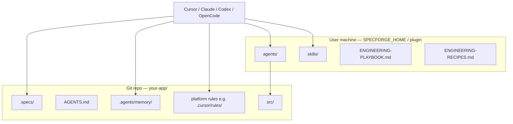

# Bootstrap plan: spec-driven engineering team (multi-tool)

**Goal:** Harness SpecForge on a real project in under ~30 minutes, starting at **Tier 1**, with **need → minimal plan → human APPROVED** (not a full-agent ceiling).

**Install harness:** `bash scripts/install-all.sh` (or per-platform — see [`MULTI-TOOL.md`](MULTI-TOOL.md))

**Last updated:** 2026-07-11 · Aligns with `ENGINEERING-RECIPES.md` §0 and `agents/eng-orchestrator.md`.

### SPECFORGE_HOME (first path that exists)

| Platform | SPECFORGE_HOME | Agents / skills live in |
|----------|----------------|-------------------------|
| Cursor | `~/.cursor/` (docs) | Plugin: `~/.cursor/plugins/local/specforge-engineering-team` → repo |
| Codex | `~/.codex/specforge/` | Skills: `~/.agents/skills/`; prompt via `AGENTS.md` |
| OpenCode | `~/.config/opencode/specforge/` | `~/.config/opencode/agents/`, `skills/` |
| Claude Code | `~/.claude/docs/specforge/` | `~/.claude/agents/`, `~/.claude/skills/` (symlinks) |

**Project-level (commit):** `.specs/`, `AGENTS.md`, `.agents/memory/`, platform overlays (e.g. `.cursor/rules/`)

---

## Architecture: two layers



- **User layer** = roles, skills, playbooks (install once).
- **Project layer** = specs + `.agents/memory/` (commit). Cursor may also expose memory via `.cursor/agent-memory/` **symlink** — prefer editing `.agents/memory/`.

---

## Phase 0 — Verify harness (5 min, once)

```bash
# Cursor plugin (primary after install.sh / install-all.sh)
ls ~/.cursor/plugins/local/specforge-engineering-team/agents/*.md | wc -l   # expect 20
ls -d ~/.cursor/plugins/local/specforge-engineering-team/skills/spec-* | wc -l  # expect ≥9
test -f ~/.cursor/ENGINEERING-PLAYBOOK.md && echo "playbook OK"
test -f ~/.cursor/ENGINEERING-RECIPES.md && echo "recipes OK"

# Claude (if installed)
ls ~/.claude/agents/*.md 2>/dev/null | wc -l
# OpenCode
ls ~/.config/opencode/agents/*.md 2>/dev/null | wc -l
# Codex skills
ls -d ~/.agents/skills/spec-* 2>/dev/null | wc -l
```

**Cursor:** Restart → Settings → Plugins → enable **specforge-engineering-team**. Smoke:

```
/eng-orchestrator
Recipe: advisory-only
Tier: 0
In one paragraph: what does SpecForge do?
```

Expect a short readonly answer.

---

## Phase 1 — Create or open project (2 min)

1. Open app folder in your tool (**File → Open Folder** / CLI cwd).
2. `git init` if new.
3. Choose **smallest viable tier** (default **1**):

| Tier | When |
|------|------|
| 0 | Throwaway spike |
| **1** | **MVP / new app (start here)** |
| 2 | Users, releases, security surface |
| 3 | Enterprise, PII, multi-service, regulated |

Record: `Tier: 1` — do **not** pick a production recipe until the need checklist runs.

---

## Phase 2 — Bootstrap scaffold (5 min)

From the **harness repo** (or any clone that has `scripts/bootstrap-project.sh`):

```bash
# All platform overlays (default)
bash scripts/bootstrap-project.sh /path/to/your-app

# Or one platform:
bash scripts/bootstrap-project.sh --platform cursor /path/to/your-app
bash scripts/bootstrap-project.sh --platform codex /path/to/your-app
bash scripts/bootstrap-project.sh --platform opencode /path/to/your-app
bash scripts/bootstrap-project.sh --platform claude /path/to/your-app
```

Creates/links: `.specs/`, `AGENTS.md`, `.agents/memory/` (+ Cursor rules / aliases as applicable).

Optional `.cursorignore` (see playbook §7): `dist/`, `build/`, `node_modules/`, `*.lock`, `coverage/`, `.terraform/`, `*.tfstate`

**Commit scaffold:**

```bash
cd /path/to/your-app
git add .specs AGENTS.md .agents scripts .cursor .cursorignore 2>/dev/null || true
git add .specs AGENTS.md .agents
git status   # confirm .agents/memory is staged
git commit -m "chore: bootstrap spec-driven engineering scaffold"
```

---

## Phase 3 — Fill project memory (5 min)

Edit **canonical** paths:

| File | Fill in |
|------|---------|
| `.agents/memory/_project/MEMORY.md` | App name, stack, test command, branch strategy, **who may APPROVE specs** |
| `.agents/memory/_project/specs-index.md` | REQ-001 / ARCH-000 status |
| `.agents/memory/eng-orchestrator/MEMORY.md` | Leave Active plan section for first run |
| `.specs/requirements/REQ-001-*.md` (if present) | Problem + 3–5 testable acceptance criteria (keep **DRAFT**) |

Cursor alias: `.cursor/agent-memory/` → same content. Rules: `.cursor/rules/spec-driven.mdc` (Tier-aware), `agent-memory.mdc`, `ponytail.mdc`.

---

## Phase 4 — First agent session (Tier 1)

Open **Agent** chat in the **project** folder. Prefer **`/eng-orchestrator`** (not a hardcoded agent list).

### Starter prompt

```
/eng-orchestrator

Tier: 1

We are building [ONE PARAGRAPH: users, core outcome, preferred stack if known].

Follow ENGINEERING-RECIPES.md §0:
1. Run need checklist; pick smallest recipe (likely new-application then capability, or capability alone if app already scoped).
2. Build minimal plan from recipe×tier matrix (R agents only; state skipped).
3. requirements-analyst → REQ DRAFT → challenger only if consequential → STOP for user APPROVED on disk.
4. Do not implement until REQ Status: APPROVED (user). ARCH only if durable boundary crossed.
5. Then: implementer(s) by surface → test-runner → verifier (SHA + test report).
6. Persist Active plan in eng-orchestrator MEMORY (agents_planned / skipped / adapt watchers).
7. End with full HANDOFF (Need, Recipe, Tier, Plan, parent_REQ, Human gate).
```

### Tier 1 minimal shape (typical)

```
eng-orchestrator
  → need checklist → recipe (e.g. new-application / capability)
  → requirements-analyst (REQ DRAFT)
  → [optional challenger]
  → **YOU set Status: APPROVED on the REQ file**
  → implementer (backend | frontend | fullstack | … by surface)
  → test-runner (save report path)
  → verifier (REQ + SHA + test report)
```

**Hard stop:** If status is still `DRAFT` / HANDOFF says `READY_FOR_APPROVAL`, do not continue to implementers.

### After first slice

```
/eng-orchestrator Tier 1 — diagnose need for [next change]; minimal plan; no default greenfield ceiling
```

---

## Phase 5 — Production recipes (after go-live)

**Always diagnose need first** (`ENGINEERING-RECIPES.md` §0). Recipe hints are not automatic:

| Need | Candidate recipe |
|------|------------------|
| New user-facing capability | `greenfield-feature` (`capability`) — **minimal Tier 1 plan** |
| Defect | `bug-fix` |
| Prod-urgent | `hotfix` (downgrade if not urgent) |
| Deps / refactor | `maintenance` |
| IaC / CI / env | `infra-change` |
| CVE | `security-patch` |
| Specs only | `spec-only` |
| Should we / review | `advisory-only` |

Cheat sheet: `/spec-recipes` · entry: `/spec-pipeline` (defers to §0 — not a full-ceiling mandate).

---

## Phase 6 — Promote tier (only with evidence)

**Tier 1 → 2** when:

- [ ] Public API / external consumer
- [ ] Auth, PII, or payments
- [ ] Repeated bugs from unclear specs
- [ ] Second person/agent must resume without re-explaining

**Add** matrix **R** agents for Tier 2 (architect, challenger, reviewers, guardian as required) — not “every agent.”

**Tier 2 → 3** when multi-service / regulated / full contracts required. Use the **recipe×tier ceiling** in recipes §0 — still omit agents the checklist does not justify. Do **not** “run all 20” by default.

Document promotion in `_project/MEMORY.md`.

---

## Phase 7 — Operating rhythm

### Per change (Tier 1)

1. Need checklist → recipe × tier → `agents_planned`
2. REQ/BUG as required; **user APPROVED** when gated
3. Implement → test-runner → verifier (in-scope bar)
4. Update `specs-index` + orchestrator Active plan
5. Checkpoint (Principle 8); new chat when REQ/phase DONE

### Per gate

Persist specs + memory (**including agents_planned**) → delegate ≤500 words, paths only → no resume across REQ→implement→verify

### Per release (Tier 2+)

1. `spec-guardian` (Blocking vs advisory)
2. `collect-release-metrics.sh` + `estimate-pipeline-tokens.sh --agents <planned>` + `spec-release-metrics`
3. `distill-learning-journal.sh` if used

### Hotfix policy

If code-review deferred: human ACK on disk + complete review within **48h**; backfill BUG/CHANGELOG.

---

## Quick reference

| Command | Purpose |
|---------|---------|
| `/eng-orchestrator` | Need → recipe × tier → minimal plan (primary) |
| `/spec-recipes` | Recipe picker (after need checklist) |
| `/spec-pipeline` | Entry cheat sheet (defers to §0) |
| `/requirements-analyst` | REQ DRAFT |
| `/challenger` | Adversarial review (≤2 rounds → human) |
| `/architect` | ARCH DRAFT |
| Implementers | `/backend-engineer` `/frontend-engineer` `/fullstack-engineer` `/mobile-engineer` `/data-engineer` |
| `/debugger` | BUG-NNN + root cause |
| `/test-runner` `/verifier` `/spec-guardian` | Test / verify / drift |
| `/platform-engineer` `/sre-devops` | IaC / CI-observability |

---

## Bootstrap checklist

### User machine (once)

- [ ] Cursor plugin path shows 20 agents (or Claude/OpenCode agent dirs)
- [ ] `spec-*` skills visible (≥9)
- [ ] Playbook + recipes at SPECFORGE_HOME
- [ ] Advisory-only smoke test passed

### Per project

- [ ] `.specs/` + **`.agents/memory/`** committed
- [ ] `AGENTS.md` present
- [ ] Tier-aware `spec-driven` rule (ARCH not always required at Tier 1)
- [ ] MEMORY filled; **named APPROVER**
- [ ] REQ-001 DRAFT with acceptance criteria
- [ ] First orchestrator run used need checklist + minimal plan
- [ ] User set REQ `APPROVED` on disk before implement
- [ ] Verifier passed with SHA + test report

### Before Tier 2

- [ ] Tier 1 pilot shipped
- [ ] Verifier or resume-from-specs proved useful
- [ ] Promotion trigger noted in MEMORY

---

## Troubleshooting

| Problem | Fix |
|---------|-----|
| Agents missing in Cursor | `ls ~/.cursor/plugins/local/specforge-engineering-team`; enable plugin; restart |
| Wrong verify path (`~/.cursor/agents`) | Use plugin path above — see README |
| Too much ceremony | Stay Tier 1; omit O agents; `bug-fix` / `advisory-only` |
| Implement before APPROVED | Stop; set REQ status yourself; re-run orchestrator |
| Agent ignores specs | Point at `.specs/...` paths; check rules |
| Memory not in git | Commit `.agents/memory/` (not only `.cursor/`) |
| Token burn | Paths-only HANDOFF; minimal plan; `--agents` estimates |

---

## Suggested 7-day rollout

| Day | Action |
|-----|--------|
| **1** | Phase 0–3: scaffold, MEMORY, REQ-001 DRAFT, Tier 1 |
| **2** | Need checklist → minimal slice → **you APPROVE** → implement → verify |
| **3** | Tests + stack notes in MEMORY; Active plan habit |
| **4** | Second change: diagnose need; capability **minimal** or bug-fix |
| **5** | One `bug-fix` with BUG-NNN |
| **6** | Planned vs run + in-scope verify notes (lightweight REL optional) |
| **7** | Keep Tier 1 or promote with evidence |

---

## Related docs

- `SPECFORGE_HOME/ENGINEERING-PLAYBOOK.md`
- `SPECFORGE_HOME/ENGINEERING-RECIPES.md` §0
- `SPECFORGE_HOME/ENGINEERING-METRICS.md`
- `SPECFORGE_HOME/MULTI-TOOL.md`
- `SPECFORGE_HOME/SPEC-DRIVEN-EXECUTIVE-SUMMARY.md` (historical banner; recipes §0 is operable truth)

---

*Start small (Tier 1). Diagnose need. Human approves. Earn complexity.*
