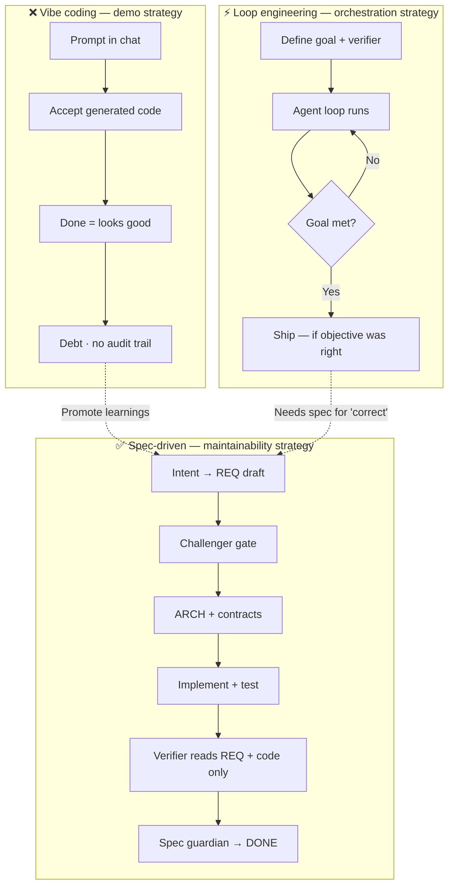

# Spec-Driven Engineering Is Not a Fad. Vibe Coding and Loop Maxxing Are.

**Formats in this file:** Full blog article · LinkedIn-native cut (~1,200 words) · Social diagram  
**Audience:** Engineering leaders, architects, senior ICs  
**Companion:** [`SPEC-DRIVEN-EXECUTIVE-SUMMARY.md`](./SPEC-DRIVEN-EXECUTIVE-SUMMARY.md)

---

## LinkedIn post hook (copy/paste)

> Vibe coding gets you a demo. Loop engineering gets you autonomy. Neither gets you maintainable software.
>
> Spec-driven engineering does — and Google, Microsoft, and Thoughtworks are all converging on why specs must come first in the agentic era.
>
> Here is how to tell durable practice from temporary fad. 👇

**Hashtags (optional):** `#SpecDrivenDevelopment #AIEngineering #SoftwareArchitecture #EngineeringLeadership #Cursor #AgenticAI`

---

## Visual: three approaches compared

Use this Mermaid diagram in presentations, or export as PNG for LinkedIn carousel slide 1.



### ASCII version (LinkedIn comment or plain-text posts)

```
VIBE CODING          LOOP ENGINEERING       SPEC-DRIVEN ENGINEERING
────────────────     ──────────────────     ─────────────────────────
Prompt → accept      Goal → loop → verify    Intent → REQ → ARCH
Chat = truth         Autonomy = goal         .specs/ = truth
Fast demo            Batch execution         Durable product
Debt compounds       Token burn if vague     Upfront cost, lower rework
```

### Comparison table (carousel slide 2)

| Dimension | Vibe coding | Loop engineering | Spec-driven engineering |
|-----------|-------------|------------------|-------------------------|
| **Primary artifact** | Chat + code | Loop + verifier | `.specs/` (REQ, ARCH, contracts) |
| **Optimizes for** | Immediacy | Autonomous execution | Intent durability |
| **"Done" means** | Looks good in chat | Goal condition met | REQ criteria + isolated verify |
| **Best for** | Spikes, throwaways | Batch work with clear checks | Products maintained for years |
| **Failure mode** | Silent debt | Hallucinated productivity | Ceremony if over-applied |
| **Research alignment** | High defect/debt risk | Needs spec for correctness | Thoughtworks Assess; Microsoft SDD |

---

# Part 1 — Full blog article

## The problem everyone is trying to solve

AI made code cheap to generate. It did not make **correct, maintainable software** cheap to produce.

Google's randomized controlled trial with roughly 96 engineers found AI tools sped up task completion by about **21%** ([arXiv:2410.12944](https://arxiv.org/abs/2410.12944)). Microsoft Research's field experiments across ~4,867 developers reported about **26%** more completed tasks ([Microsoft Research](https://www.microsoft.com/en-us/research/publication/the-effects-of-generative-ai-on-high-skilled-work-evidence-from-three-field-experiments-with-software-developers/)).

Those numbers measure **copilot-style assist** — a developer in flow, AI suggesting completions. They do not measure what happens when an agent owns the pipeline, or when nobody writes down what "done" means.

Other studies complicate the picture. A longitudinal analysis of 703 repositories found **no significant change in commit-based activity** after Copilot adoption despite positive developer perception ([arXiv:2509.20353](https://arxiv.org/abs/2509.20353)). Research on AI-authored commits found hundreds of thousands of issues, with roughly **24% persisting as long-term debt** ([arXiv:2603.28592](https://arxiv.org/abs/2603.28592)).

**Velocity metrics are not quality metrics.** That gap is where spec-driven engineering lives.

---

## What spec-driven engineering is

Spec-driven development treats **structured specifications as the source of truth** — not chat history, not the last agent's summary, and not whatever happened to compile.

Microsoft frames it plainly: AI made delivery faster, but speed alone does not guarantee alignment. SDD makes structured specs the **shared context for humans and AI** — align first, then accelerate ([Microsoft for Developers](https://developer.microsoft.com/blog/spec-driven-development-ai-native-engineering)).

Thoughtworks describes the same separation: SDD goes **beyond vibe coding** by splitting design from implementation. Requirements are formalized, reviewed with a human in the loop, then handed to an agent ([Thoughtworks blog](https://www.thoughtworks.com/insights/blog/agile-engineering-practices/spec-driven-development-unpacking-2025-new-engineering-practices)).

Recent practitioner research articulates three rigor levels ([arXiv:2602.00180](https://arxiv.org/pdf/2602.00180)):

| Level | Meaning |
|-------|---------|
| **Spec-first** | Specs guide a task or feature |
| **Spec-anchored** | Specs evolve as living documentation |
| **Spec-as-source** | Spec is the primary artifact; code is generated from it |

Most teams should start at spec-first or spec-anchored.

In the SpecForge model, durable artifacts live in version-controlled `.specs/`:

```
requirements/     → REQ docs with acceptance criteria
architecture/     → ARCH, ADRs, contracts, test plans
handoffs/         → structured gate checkpoints
```

**Code is an output of specs.** Specs are what future humans and agents maintain.

---

## Vibe coding: fast today, expensive tomorrow

**Vibe coding** is prompt → accept → minimal review. It optimizes for the feeling of progress.

Legitimate for **Tier 0**: throwaway spikes, demos, API exploration. Poor default for anything you will extend, audit, or hand to another engineer.

Why it fails at scale:

- No durable source of truth — intent lives in chat
- Weak traceability — bugs cannot map to criteria that never existed
- Conformist failure mode — each agent validates the last narrative
- Debt compounds — unreviewed AI code shows higher persistent defect rates

Vibe coding asks: *"Can we see something working by Friday?"*  
Spec-driven engineering asks: *"Will we understand why it works next quarter?"*

---

## Loop engineering: orchestration, not specification

Loop engineering shifts from turn-by-turn prompting to **autonomous loops**: define a goal, attach verifiers, let subagents iterate until completion ([Addy Osmani — Loop Engineering](https://addyo.substack.com/p/loop-engineering)).

Claude Code ships `/goal`, `/loop`, `/schedule`. Codex embeds similar primitives. The pattern is real and productized.

But loop engineering solves **orchestration**, not **intent**. No volume of recursive cycles salvages a poorly specified objective ([TechTalks](https://bdtechtalks.com/2026/06/22/ai-loop-engineering/amp/)).

**Loops and specs are complementary:**

```
Intent → REQ (approved) → ARCH + contracts (approved)
      → Loop / agent pipeline executes against spec
      → Verifier reads REQ + code (not agent summaries)
      → Spec guardian catches drift
```

Loop engineering tells agents **how to keep working**. Spec-driven engineering tells them **what correct means**.

---

## The non-conformist pipeline

Most toolkits stop at "write a spec, then implement." A rigorous model adds **adversarial gates** to prevent multi-agent groupthink:

```
Intent → REQ (draft) → Challenger → REQ (APPROVED)
      → ARCH + ADRs + contracts (draft) → Challenger → ARCH (APPROVED)
      → Implement → Test plan → Test run → Review (parallel)
      → Verifier (REQ + code only) → Spec guardian → DONE
```

| Mechanism | Prevents |
|-----------|----------|
| Mandatory challenger | Specs shipping without pushback |
| Verifier isolation | Verification from implementer summaries |
| Spec guardian | Drift between specs and code |
| Structured handoffs | Context loss across agents |

Thoughtworks remains appropriately skeptical: spec drift and hallucination are hard to eliminate; CI/CD still matters ([Technology Radar](https://www.thoughtworks.com/radar/techniques/spec-driven-development)). SDD compresses context into specs — it does not abolish software engineering.

---

## Right-sizing: ceremony is not the default

| Tier | Profile | Spec footprint |
|------|---------|----------------|
| **0 — Spike** | Demo, exploration | Notes only |
| **1 — Small app / MVP** | Low compliance | REQ only |
| **2 — Productized** | Users, releases | REQ + ARCH + ADRs |
| **3 — Enterprise / regulated** | Security, PII | Full `.specs/` tree |

**Default:** Tier 1. Promote when you have multiple feature areas, external APIs, auth/PII, or repeated spec-gap bugs.

Allow vibe coding at Tier 0. Allow loops where verifiers are trustworthy. Require specs before production merge.

---

## What research proves (and what it does not)

**Proven (with caveats):**

- AI assist improves individual throughput (Google ~21%, Microsoft ~26%)
- Unreviewed AI code carries measurable debt (~24% persistent issues)
- Industry converges on spec-first workflows (Thoughtworks, Microsoft, GitHub Spec Kit)

**Not proven publicly:**

- 15–20 agent pipelines beating senior teams on time-to-production
- Mandatory challenger gates always net-positive on small features
- Spec-driven agents reducing incidents without spec quality investment

**Measure internally:** REQ criterion coverage, spec drift rate, rework after "done", token cost per shipped REQ. Run A/B: vibe-coded vs spec-driven on similar scope.

---

## Recommendation matrix

| Goal | Approach |
|------|----------|
| Prototype in days | Vibe coding or AI-assisted |
| Daily productivity | AI-assisted + light REQ for large changes |
| Product maintained with agents for years | **Spec-driven pipeline** |
| Regulated / high-trust | Spec-driven + human approval on APPROVED specs |

Humans own **intent, approval, exceptions**. Agents own **drafting, implementation, tests, drift detection**.

---

## The takeaway

Vibe coding is a **demo strategy**. Loop engineering is an **orchestration strategy**. Spec-driven engineering is a **maintainability strategy**.

Google and Microsoft showed AI can make skilled developers faster at discrete tasks. Thoughtworks showed why separating planning from implementation matters in the agentic era. Practitioner research is formalizing rigor levels from spec-first to spec-as-source.

The limiting factor is no longer code generation speed. It is how clearly intent is captured, shared, and validated across the lifecycle.

The teams that win will not have the longest agent loops or the hottest vibe-coded demos. They will have specs that outlive the session — and software that still matches them on release day.

---

## References

- [Thoughtworks — Spec-driven development (2025 practices)](https://www.thoughtworks.com/insights/blog/agile-engineering-practices/spec-driven-development-unpacking-2025-new-engineering-practices)
- [Thoughtworks — Technology Radar: Spec-driven development](https://www.thoughtworks.com/radar/techniques/spec-driven-development)
- [Microsoft — Spec-Driven Development: AI-Native Engineering](https://developer.microsoft.com/blog/spec-driven-development-ai-native-engineering)
- [GitHub — Spec Kit toolkit](https://github.blog/ai-and-ml/generative-ai/spec-driven-development-with-ai-get-started-with-a-new-open-source-toolkit/)
- [Google — AI impact RCT (arXiv:2410.12944)](https://arxiv.org/abs/2410.12944)
- [Microsoft Research — Field experiments on developer productivity](https://www.microsoft.com/en-us/research/publication/the-effects-of-generative-ai-on-high-skilled-work-evidence-from-three-field-experiments-with-software-developers/)
- [Practitioner guide — Spec-Driven Development: From Code to Contract (arXiv:2602.00180)](https://arxiv.org/pdf/2602.00180)
- [AI-generated code debt (arXiv:2603.28592)](https://arxiv.org/abs/2603.28592)
- [Addy Osmani — Loop Engineering](https://addyo.substack.com/p/loop-engineering)
- Internal: [`SPEC-DRIVEN-EXECUTIVE-SUMMARY.md`](./SPEC-DRIVEN-EXECUTIVE-SUMMARY.md)

---

# Part 2 — LinkedIn-native version (~1,200 words)

*Paste below the hook. Break into 2–3 comments if LinkedIn truncates.*

---

Every few months, software engineering gets a new slogan.

In 2025 it was **vibe coding** — prompt, accept, ship.

In 2026 it is **loop engineering** — stop prompting, design autonomous agent loops that run until something says "done."

Both trends are real. Both produce impressive demos.

Neither is a substitute for **spec-driven engineering**.

---

### The data behind the hype

Google's RCT (~96 engineers): AI tools sped task completion by **~21%** ([arXiv:2410.12944](https://arxiv.org/abs/2410.12944)).

Microsoft's field experiments (~4,867 developers): **~26%** more completed tasks ([Microsoft Research](https://www.microsoft.com/en-us/research/publication/the-effects-of-generative-ai-on-high-skilled-work-evidence-from-three-field-experiments-with-software-developers/)).

But a study of 703 repos found **no significant change in commit activity** after Copilot — despite developers feeling faster ([arXiv:2509.20353](https://arxiv.org/abs/2509.20353)).

And research on AI-authored commits? **~24% of issues persist as long-term debt** ([arXiv:2603.28592](https://arxiv.org/abs/2603.28592)).

Velocity ≠ quality. That is the gap spec-driven engineering fills.

---

### Three models, three outcomes

**Vibe coding** — demo strategy  
Prompt → accept code → "looks good" → ship.  
Fast today. Expensive tomorrow. No audit trail.

**Loop engineering** — orchestration strategy  
Define goal + verifier → agent loops until done.  
Powerful for batch work. Dangerous without a clear objective. As TechTalks notes: no loop salvages a bad spec.

**Spec-driven engineering** — maintainability strategy  
Intent → approved REQ → ARCH + contracts → implement → verify against spec → guard against drift.  
Slower start. Sustainable at scale.

Loops tell agents *how to keep working*.  
Specs tell them *what correct means*.

They are complementary — not competing.

---

### What Thoughtworks and Microsoft actually say

Thoughtworks calls spec-driven development one of 2025's most important AI-assisted practices — while placing it in the **Assess** ring, not Adopt ([blog](https://www.thoughtworks.com/insights/blog/agile-engineering-practices/spec-driven-development-unpacking-2025-new-engineering-practices), [Radar](https://www.thoughtworks.com/radar/techniques/spec-driven-development)).

That is healthy skepticism. SDD separates design from implementation. It does not eliminate CI, drift, or human judgment.

Microsoft's framing: AI made delivery faster, but alignment is the hard part. SDD makes structured specs the shared source of truth for humans and AI — **align first, then accelerate** ([Microsoft for Developers](https://developer.microsoft.com/blog/spec-driven-development-ai-native-engineering)).

Practitioner research adds three rigor levels ([arXiv:2602.00180](https://arxiv.org/pdf/2602.00180)):

- **Spec-first** — guide a feature  
- **Spec-anchored** — living docs alongside code  
- **Spec-as-source** — spec is the maintained artifact  

Most teams should start at spec-first. Not every project earns Tier 3 ceremony.

---

### Right-sizing beats purity

| Tier | When | What you need |
|------|------|---------------|
| 0 | Spike / demo | Notes, vibe coding OK |
| 1 | MVP, solo builder | REQ + 5-role agent team |
| 2 | Product with users | REQ + ARCH + challenger |
| 3 | Regulated / enterprise | Full `.specs/` tree |

**Default: Tier 1.** Promote when you have auth/PII, external APIs, or bugs traced to missing requirements.

Vibe code the spike. Spec the production merge.

---

### What to measure (because public benchmarks are scarce)

No published study proves a 20-agent pipeline beats a senior team on time-to-production.

Run your own pilot:

- REQ criterion coverage (% criteria with test + verifier sign-off)  
- Spec drift rate (guardian findings per release)  
- Rework after "done" (spec gap vs code bug)  
- Token cost per shipped REQ vs vibe baseline  

A/B two similar features: vibe-coded vs spec-driven. That teaches more than any thread.

---

### The bottom line

**Vibe coding** gets you a demo.  
**Loop engineering** gets you autonomy.  
**Spec-driven engineering** gets you software someone else can maintain — human or agent — six months from now.

Google and Microsoft proved AI makes developers faster at tasks.  
Thoughtworks proved why specs must precede agent execution.  
The industry is converging on the same shape: intent → spec → implement → verify.

The teams that win will not have the longest loops or the flashiest demos.

They will have specs that outlive the chat session.

---

*Full article, diagrams, and executive summary: see `docs/SPEC-DRIVEN-LINKEDIN-ARTICLE.md` and `docs/SPEC-DRIVEN-EXECUTIVE-SUMMARY.md` in the SpecForge repo.*

---

## Publishing checklist

- [ ] Post hook as opening lines; paste Part 2 below or link to full blog
- [ ] Attach Mermaid diagram as carousel slides 1–2 (export PNG from Mermaid Live or GitHub preview)
- [ ] Tag 2–3 colleagues who care about AI engineering governance
- [ ] First comment: link to Thoughtworks blog + Microsoft SDD post for credibility
- [ ] Second comment: "Tier 0 = vibe OK. Tier 1+ = spec before merge." (engagement bait that is actually useful)
